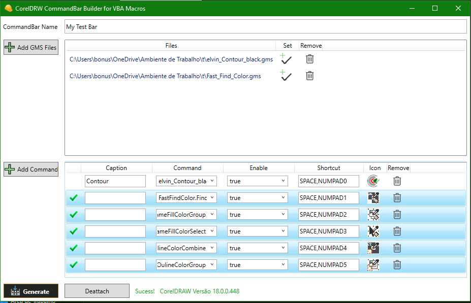

# Custom Shortcut Bar for CorelDRAW Macros
This repository contains a tool for generating custom shortcut bars for macros in CorelDRAW. With this tool, you can create a personalized bar of macros and save it to an empty folder. Later, this folder needs to be copied to the CorelDRAW installation directory, specifically in the **addons folder**. This will allow the shortcut bar to be created using CorelDRAW's addon system.

### Extra library
https://github.com/dblock/resourcelib

## Advantages

1. Preservation of the custom bar: When restoring CorelDRAW to its factory default settings, our custom bar will not be lost. It will remain available for use even after the restoration.
2. Easy distribution: Sharing the custom shortcut bar is extremely convenient. Simply copy the folder containing the files and share it with interested users. They can then install it in their own addons folder.
3. Simplified removal: If you ever wish to remove the custom shortcut bar, you can easily do so by deleting the folder.

## Disadvantages

1. Macro loading timing: Macros are loaded when the shortcut bar is opened, and they do not benefit from CorelDRAW's macro delay loading system.
2. Duplicate macros in multiple bars: Macros that are repeated in multiple bars will be loaded multiple times according to the number of bars that contain them.
Additionally, this software provides a faster creation speed compared to CorelDRAW's native customization system.